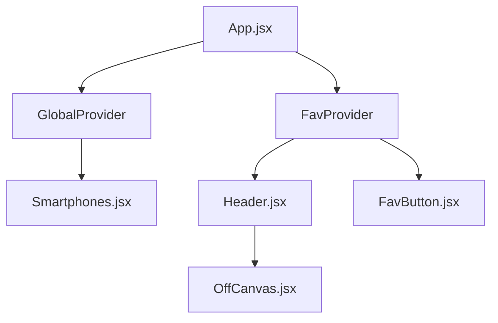

# Progetto Finale: Documentazione Completa

## Descrizione Generale
Questo repository contiene due progetti principali: un backend (API REST) e un frontend (applicazione web) che collaborano per fornire una soluzione completa. Il backend gestisce la logica di business, l’accesso ai dati e l’autenticazione, mentre il frontend offre un’interfaccia utente moderna e reattiva.

---

## Struttura del Repository
- `/backend` — Contiene il codice sorgente del server (API REST, database, autenticazione, ecc.)
- `/frontend` — Contiene il codice sorgente dell’applicazione web (React/Vue/Angular, gestione stato, chiamate API, ecc.)

---

## Prerequisiti
- Node.js (versione consigliata: >= 18)
- npm

---

## Installazione

### 1. Clona il repository
```bash
git clone <url-del-repository>
cd <nome-cartella-repository>
```

### 2. Installazione Backend
```bash
cd backend
npm install
```

### 3. Installazione Frontend
```bash
cd ../frontend
npm install
```

---

## Avvio dei Progetti

### Avvio Backend
```bash
cd backend
npm run start
```
Il backend sarà disponibile su `http://localhost:3001` (o la porta configurata).

### Avvio Frontend
```bash
cd frontend
npm run dev
```
Il frontend sarà disponibile su `http://localhost:5173`.

---

## Architettura e Flusso di Lavoro

1. **Frontend**: L’utente interagisce con l’interfaccia web. Le azioni dell’utente ( visualizzazione dati) generano richieste HTTP verso il backend.
2. **Backend**: Riceve le richieste dal frontend, esegue la logica di business (accesso dati su database) e restituisce le risposte (dati, errori, conferme).
3. **Database**: Il backend comunica con il database per leggere dati.
4. **Risposta**: Il backend invia la risposta al frontend, che aggiorna l’interfaccia utente di conseguenza.

## Panoramica dell'Applicazione

L'applicazione è un catalogo di smartphone costruito in React che implementa diverse funzionalità avanzate con particolare attenzione alle performance. Il progetto utilizza una architettura modulare basata su custom hooks, context API e componenti ottimizzati per garantire un'esperienza utente fluida e reattiva.


## Struttura del Progetto

```
src/
├── App.jsx                 # Entry point principale, orchestrazione context e routing
├── pages/
│   ├── Homepage.jsx          # Landing page con carousel
│   ├── Smartphones.jsx       # Lista filtrata e ordinata
│   ├── Smartphone.jsx        # Dettaglio singolo prodotto
│   ├── Compara.jsx          # Comparazione multipla
│   └── NotFound.jsx         # Pagina errore 404
├── layouts/
│   └── DefaultLayout.jsx    # Layout principale con header/footer
├── hooks/
│   └── useSmartphoneSearch.js # Custom hook per ricerca con debounce
├── context/
│   ├── GlobalContext.jsx    # Stato globale per dati condivisi
│   └── FavContext.jsx       # Gestione preferiti con localStorage e state showOffCanvas
├── components/
│   ├── common/
│   │   ├── Header.jsx       # Navbar ottimizzata, gestione preferiti
│   │   ├── Footer.jsx       # Footer minimale e performante
│   │   └── Loader.jsx       # Loader animato, rendering condizionale
│   ├── ui/
│   │   ├── Carousel.jsx     # Swiper carousel ottimizzato
│   │   ├── FavButton.jsx    # Bottone preferiti reattivo
│   │   └── OffCanvas.jsx    # Sidebar scorrevole
│   └── smartphone/
│       └── SmartphoneCard.jsx # Card dettaglio prodotto
```

---

## Dettagli Frontend
Il frontend è una SPA (Single Page Application) sviluppata in React. Di seguito vengono descritte le principali componenti e funzionalità implementate:

### 1. Global Context
L’accesso globale allo stato e ai preferiti è garantito tramite i provider `GlobalProvider` e `FavProvider`, che avvolgono l’intera struttura delle route. Questi contesti globali (basati su React Context API) permettono di gestire dati e funzioni condivise tra più componenti, come lo stato dell’utente autenticato, le preferenze e le notifiche, evitando il prop drilling e centralizzando la logica di accesso ai dati globali. 

### 2. Custom Hook
Sono stati sviluppati custom hook per incapsulare logiche riutilizzabili e mantenere il codice dei componenti più pulito e leggibile. Ad esempio, il custom hook `useSmartphoneSearch` gestisce l’intera logica di ricerca e filtraggio degli smartphone, includendo funzionalità come il debounce delle query per ottimizzare le chiamate API e migliorare le prestazioni dell’interfaccia utente.

### 3. Gestione dello Stato e degli Effetti
La gestione dello stato locale e degli effetti collaterali nel frontend avviene tramite i principali hook e funzionalità di React:

- `useState` per gestire lo stato locale dei componenti.
- `useEffect` per gestire effetti collaterali come chiamate API, sincronizzazione dati e aggiornamento del DOM.
- `useRef` per mantenere riferimenti mutabili tra i render, ad esempio per accedere direttamente a elementi DOM o conservare valori persistenti.
- `useMemo` per ottimizzare le prestazioni memorizzando valori calcolati e prevenire ricalcoli inutili.
- `React.memo` per ottimizzare la resa dei componenti memorizzando il risultato del rendering e prevenendo render inutili quando le props non cambiano.

Lo stato globale (ad esempio, i preferiti) è gestito tramite il `FavContext`.

### 4. Carousel
Il componente carousel è integrato con la libreria Swiper e viene utilizzato per visualizzare le immagini degli smartphone provenienti dalla cartella `src/public/images`, ricevute come props. Ogni elemento del carousel è wrappato in uno `SwiperSlide` che funge da link alla pagina di dettaglio del singolo smartphone. Il carousel supporta autoplay, navigazione tramite swipe, ed è completamente responsive.

### 5. Default Layout
Il layout di default include header(con link all'offCanvas), footer e una sezione centrale per il contenuto dinamico. Il layout gestisce la navigazione, la visualizzazione delle notifiche e l’adattamento responsive.

### 6. Routing
La navigazione tra le pagine è gestita tramite React Router. Le principali route sono annidate all’interno di un layout di default (`DefaultLayout`). Le route definite comprendono:

- `/homepage`: homepage dell’applicazione.
- `/smartphones`: elenco degli smartphone.
- `/smartphone/:id`: dettaglio di uno smartphone specifico.
- `/compare`: pagina di confronto tra smartphone.
- `*`: pagina di errore per route non trovate.

La navigazione iniziale dalla root (`/`) reindirizza automaticamente alla homepage.
L’accesso globale allo stato e ai preferiti è garantito tramite i provider `GlobalProvider` e `FavProvider`, che avvolgono l’intera struttura delle route. La navigazione iniziale dalla root (`/`) reindirizza automaticamente alla homepage.

### 7. Chiamate API
Le chiamate verso il backend vengono effettuate sia nei singoli componenti, quando necessario per esigenze locali, sia in modo centralizzato all’interno del `GlobalContext` per la gestione di dati condivisi. In entrambi i casi, viene gestito lo stato di caricamento, gli errori e l’aggiornamento automatico dello stato dell’applicazione.

### 8. Componenti UI Personalizzati
Sono stati sviluppati componenti riutilizzabili come pulsanti, modali, card e loader, per garantire coerenza e riutilizzo del codice.

### 9. Responsive Design
L’interfaccia è completamente responsive, con breakpoints e media query per adattarsi a dispositivi desktop, tablet e mobile.

---

## 🛠️ Tecnologie Utilizzate
**🔧 Backend**
 - Node.js + Express per la gestione del server e delle rotte RESTful
 - TypeScript per la tipizzazione delle risorse
 - JWT per eventuale autenticazione (se prevista)
 - Persistenza dati tramite file JSON (file system based)
 - Validazione automatica tramite schema generato da types.ts
 - Gestione CORS per compatibilità con richieste frontend
 - Morgan per il logging delle richieste HTTP
 - Gestione asincrona di I/O e scrittura dati
 - Architettura modulare e auto-generazione dinamica delle risorse CRUD

**💻 Frontend**
 - React 19 per la costruzione dell’interfaccia utente
 - React Router DOM v7 per la gestione delle rotte client-side in SPA
 - Bootstrap 5.3 per lo styling responsive e layout mobile-first
 - Swiper.js per la creazione di caroselli e componenti interattivi
 - Lodash per utility avanzate (in particolare debounce, throttle, ecc.)
 - Fetch API per le chiamate asincrone al backend
 - Gestione dello stato con React e hook personalizzati (useState, useEffect, useMemo, useCallback)
---

## Personalizzazione e Configurazione
- Modifica le variabili d’ambiente nei file `.env` di backend e frontend per configurare porte, URL, chiavi segrete, ecc.
- Consulta la documentazione interna di ciascun progetto (`/backend/README.md` e `/frontend/README.md` se presenti) per dettagli specifici.

---

## Sviluppo e Deploy
- Per lo sviluppo, avvia entrambi i progetti in modalità dev.
- Per il deploy, crea build di produzione e configura server/proxy (es. Nginx, Docker Compose).

---

## Contatti e Supporto
Per domande o supporto, apri una issue su GitHub o contatta i maintainer del progetto.
